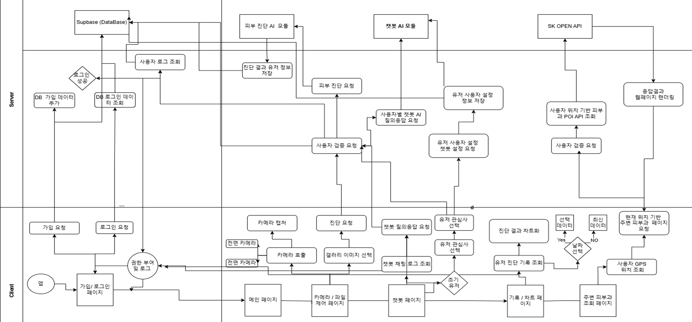

# 2025년도 1학기 캡스톤 디자인

# AI 기반 피부 상태 측정 시스템 개발 - SKINMATE

## 개발환경

### 백엔드 서버 (.NET)
| 구분 | 기술 | 버전 번호 |
| --- | --- | --- |
| 백엔드 서버 (.NET) | **.NET SDK** | **9.0.304** |
| 백엔드 서버 (.NET) | **ASP.NET Core** | 9.0.x (SDK 9.0.304 포함) |
| 백엔드 서버 (.NET) | **Entity Framework Core CLI** | **9.0.8** |
| 백엔드 서버 (.NET) | EF Core SqlServer Provider | 9.0.x |
| 백엔드 서버 (.NET) | BCrypt.Net-Next | (프로젝트 적용 버전) |
| 백엔드 서버 (.NET) | Swashbuckle.AspNetCore (Swagger) | (선택) |

### 데이터베이스 / 개발도구
| 구분 | 기술 | 버전 번호 |
| --- | --- | --- |
| 데이터베이스 | **Microsoft SQL Server** | **2019 (15.x)** |
| IDE | **Visual Studio 2022** | **17.12.2** |
| 형상관리/에디터 | Git / VS Code | (설치 버전) |

---

### 프론트엔드 앱 (.NET MAUI)
| 구분 | 기술 | 버전 번호 |
| --- | --- | --- |
| **프론트엔드 앱** | **.NET MAUI SDK** | 9.0.14 |
| **프론트엔드 앱** | Microsoft.NETCore.App.Runtime | 9.0.3.0 |
| **프론트엔드 앱** | Microsoft ASP.NET Core Runtime | 9.0.3.25112 |
| **프론트엔드 앱** | Microcharts | 1.0 |
| **프론트엔드 앱** | CommunityToolkit.Maui | 11.2.0 |
| **프론트엔드 앱** | Syncfusion.Maui | 29.2.7 |
| **프론트엔드 앱** | SkiaSharp | 3.119.0 |
| **프론트엔드 앱** | TMAP OpenAPI | Web SDK 기반 사용 |

---

### (선택) AI 추론 서버 (Python)  
> 현재 백엔드는 ASP.NET Core로 전환되었으며, 아래 파이썬 항목은 **추론 서버를 별도로 운용할 때만** 유지하세요. (미사용 시 본 섹션 삭제)

| 구분 | 기술 | 버전 번호 |
| --- | --- | --- |
| 추론 서버 | Python | 3.9.13 |
| 추론 서버 | FastAPI | 0.115.12 |
| 추론 서버 | Uvicorn | 0.34.0 |
| 추론 서버 | Starlette | 0.46.1 |
| 추론 서버 | **PyTorch** | **2.1.0** |
| 추론 서버 | TorchVision | (PyTorch 2.1.0 호환) |
| 추론 서버 | MediaPipe | 0.10.21 |
| 추론 서버 | OpenCV | 4.11.0.86 |
| 추론 서버 | NumPy | 1.26.4 |
| 추론 서버 | Python-Multipart | 0.0.20 |
| 추론 서버 | Pydantic | 2.11.3 |
 

## 프로젝트 설명

현재 많은 사용자들이 자신의 피부 상태를 주기적으로 점검하고, 이에 맞는 맞춤형 관리를 받는 데 어려움을 겪고 있습니다. 기존의 피부 분석 애플리케이션들은 단순히 촬영 이미지 기반으로 일회성 분석만을 제공하며, 부위별로 세밀하게 진단하거나 사용자의 변화 추이를 저장·분석하는 기능이 부족합니다.

본 프로젝트는 AI Hub에서 제공하는 한국인 피부 상태 측정 데이터를 기반으로 얼굴의 주요 부위(이마, 양 볼, 입술, 턱 등)를 자동으로 인식하고, 부위별로 수분, 주름, 모공, 탄력 등을 정밀하게 진단하는 모델을 개발하였습니다.

사용자는 스마트폰이나 PC 카메라로 얼굴을 촬영하면, 해당 이미지를 바탕으로 ResNet50 기반 AI 모델이 실시간으로 분석을 수행하며, 분석 결과는 직관적인 그래프(레이더 차트 등)로 시각화됩니다. 또한, 사용자 히스토리를 기록하여 피부 상태의 변화 추이를 확인할 수 있고, 챗봇 기반의 스킨케어 상담 및 위치 기반 피부과 안내 기능을 통해 사용자에게 실질적인 피부 건강 관리를 제공하고자 합니다.

## **프로젝트 목표**

- 사용자의 얼굴 이미지를 기반으로 피부 상태(수분, 주름, 모공, 탄력 등)를 부위별로 정밀하게 분석할 수 있는 AI 진단 시스템을 구축하고자 함.
- 한국인 피부 상태 측정 데이터를 활용하여 ResNet50 기반 분류 및 회귀 모델을 개발하고, 이를 부위별로 적용하여 보다 정확하고 개별화된 진단 결과를 제공할 것임.
- MediaPipe를 이용해 얼굴의 주요 부위를 자동 탐지하고, 해당 부위를 crop하여 AI 모델의 입력값으로 사용하는 구조를 설계함.
- 클라이언트 앱은 .NET MAUI를 사용해 멀티 플랫폼 환경(Android, Windows)에서 동작하도록 하며, 사용자 친화적인 UI와 직관적인 결과 시각화 기능(레이더 차트, 원형 차트 등)을 포함하여 구현할 것임.
- 서버는 FastAPI 기반으로 구현하고, 사용자 분석 결과 및 히스토리 기록을 Supabase DB에 저장하여 사용자 맞춤형 상담과 진단 이력을 관리할 수 있도록 구성할 것임.
- TMAP OpenAPI를 활용하여 피부과 병원 위치 안내 기능을 제공하고, 챗봇과의 연동을 통해 사용자 맞춤형 스킨케어 피드백을 실시간으로 제공할 수 있도록 할 것임.

## 기대효과

- 본 프로젝트를 통해 사용자는 자신의 피부 상태를 정량적으로 분석하고, 부위별 문제점을 명확히 인지할 수 있음.
- 이를 통해 주관적인 피부 평가에서 벗어나 **AI 기반의 객관적인 진단 지표**를 통해 피부 관리 방향을 설정할 수 있음.
- 분석 결과는 히스토리 형태로 저장되어 피부 상태의 변화 추이를 추적할 수 있으며, 사용자 맞춤형 스킨케어 루틴 설계에 활용될 수 있음.
- 챗봇 기능을 통해 피부 상태에 따른 실시간 피드백 및 생활 습관 조언을 제공하고, 위치 기반 병원 안내 기능을 통해 적절한 의료 서비스를 안내받을 수 있음.
- 향후 더 다양한 센서 데이터(예: 온도, 습도 등)와 연동하거나 IoT 기반 피부 측정 기기와의 연계를 통해 **홈 스킨케어 IoT 시스템**으로의 확장 가능성도 존재함.

## 프로그램 구성도

## 기술스택

- **Backend**: Python, FastAPI, Uvicorn, Supabase
- **AI Model**: PyTorch, torchvision, ResNet50, MediaPipe
- **Frontend (앱)**: .NET MAUI, C#, CommunityToolkit.MAUI, Microcharts
- **Database**: Supabase PostgreSQL
- **Mobile/PC 연동**: CameraView, Android Camera2 API (ML Kit), .NET MAUI Multi-platform Support
- **Build Tools**: pip, dotnet CLI
- **Version Control**: Git, GitHub
- **Utilities**: OpenCV, NumPy, Matplotlib, ChatBot API, TMAP OpenAPI

## 프로젝트 기여자

<table>
  <tr>
    <td align="center"><a href="https://github.com/parksanghan"> <b>박상한</b> @parksanghan</a></td>
    <td align="center"><a href="https://github.com/Kamo72"> <b>강동현</b> @Kamo72</a></td>
  </tr>
</table>